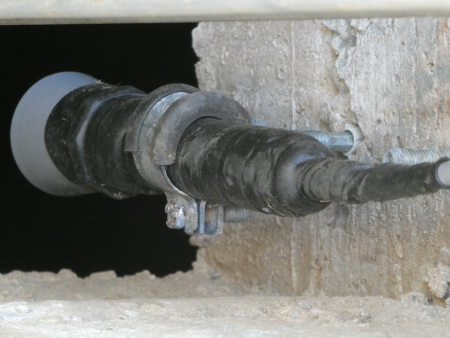
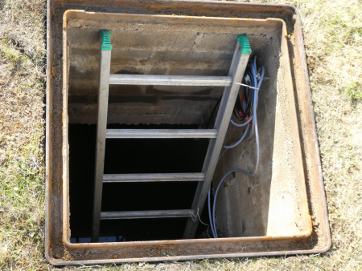

# Measuring the level in a rainwater tank with 2 different sensors

## Some infos

Again no rain for 8 weeks. Climate change should encourage us to take better care of our water. To do this, we need to know our water reserves. The water level of a rainwater tank is measured here with an ultrasonic sensor (XL-MaxSonar-WR MB7060) and a hydrostatic pressure sensor (ALS-MPM-2F).

Since 1999 I have had a round concrete rainwater tank (diameter 2.55m) which is one metre underground. It holds 10000 litres. Since 1999 my measuring devices fail regularly. This is because the environment in the tank is very hostile to electronics. Sooner or later, the high humidity destroys the plug connections. Over the years, I have tried to make the connections less vulnerable.

Everything about my current solution on:

## <http://www.weigu.lu/microcontroller/rainwater_level/index.html>

